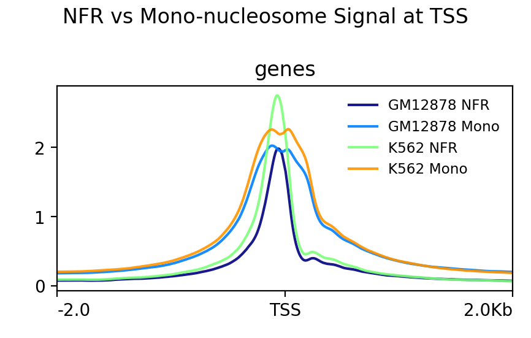
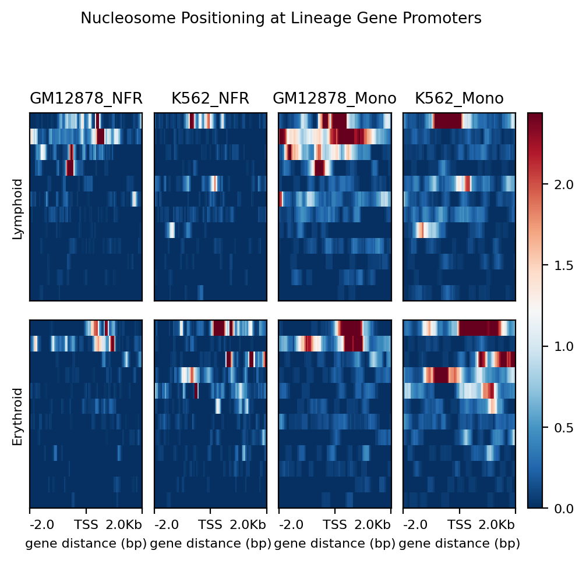
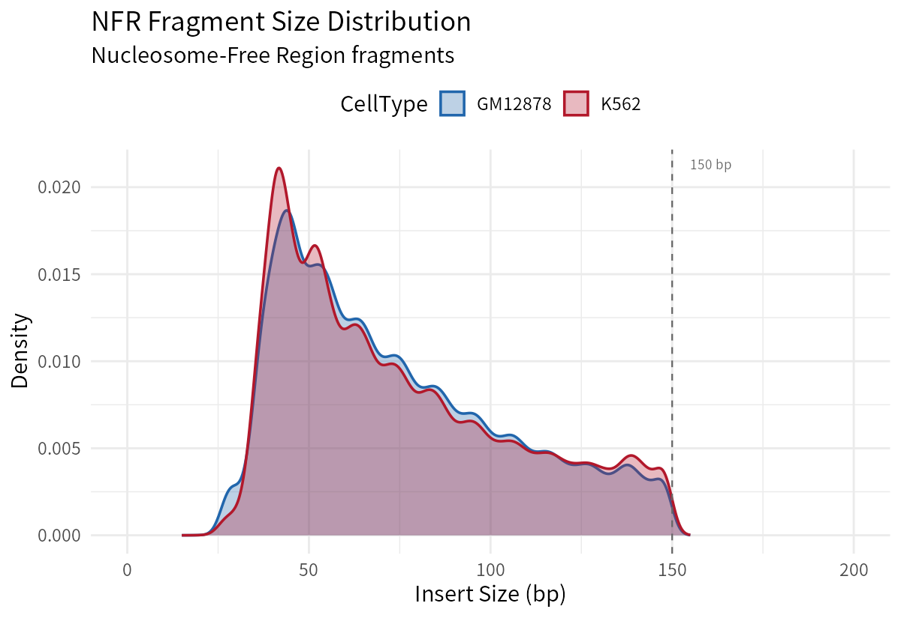

# ATAC-seq 最佳实践系列（十三）：核小体定位与 NFR 分析——染色质的精细结构

> 📋 **教程信息**
>
> - **GitHub 仓库**：[petemeng/ATAC-seq-Tutorial](https://github.com/petemeng/ATAC-seq-Tutorial)
> - **数据来源**：ENCODE GM12878 (B lymphoblastoid) vs K562 (CML) ATAC-seq，各 2 个生物学重复，PE，hg38
> - **预计阅读时间**：25 分钟
> - **难度**：⭐⭐⭐⭐
> - **前置要求**：已完成第 5 篇（比对后过滤）和第 7 篇（Peak Calling），拥有经过偏移校正的 BAM 文件和共识峰集

---

## 本篇目标

读完这一篇，你会：

1. 理解 ATAC-seq 片段长度与核小体组织之间的直接对应关系
2. 根据片段大小将 reads 分离为 NFR（无核小体区）和核小体信号
3. 分别生成 NFR 和 mono-nucleosomal 信号轨道，并在 TSS 处进行比较
4. 使用 NucleoATAC 进行精确的核小体定位
5. 在 GM12878 和 K562 之间比较谱系特异性基因启动子的核小体排布差异

---

## 为什么要关注核小体定位？

前面 12 篇，我们一直在做的事情，本质上可以归纳为一句话：**找到开放的区域，然后问"谁在那里"**。但我们几乎忽略了一个事实——ATAC-seq 的 Tn5 转座酶切下来的 DNA 片段，本身就携带着极其丰富的结构信息。

想象一下 Tn5 在染色质上工作的场景：

- 如果一段 DNA 完全暴露，没有核小体遮挡，Tn5 可以在紧挨着的位置切两刀，产出一个 **很短的片段**（< 150 bp）——这就是 **NFR（Nucleosome-Free Region，无核小体区）**
- 如果一段 DNA 正好缠绕在一个核小体上，Tn5 只能在核小体两侧切割，产出一个大约 **~200 bp** 的片段——这就是 **mono-nucleosomal fragment**
- 如果 DNA 连续缠绕在两个核小体上，片段更长，大约 **~400 bp**——这就是 **di-nucleosomal fragment**

**所以，ATAC-seq 的片段大小分布不是噪声，而是染色质精细结构的直接投影。**

---

## 片段大小与核小体状态的对应关系

| 片段大小 (bp) | 核小体状态 | 生物学含义 |
|:---:|:---:|:---|
| < 100–150 | NFR（无核小体区） | 转录因子结合位点、活跃启动子、增强子 |
| ~147–200 | Mono-nucleosomal | 单个核小体占据，+1/-1 核小体定位 |
| ~315–400 | Di-nucleosomal | 两个核小体连续占据 |
| ~473–600 | Tri-nucleosomal | 三个核小体连续占据，通常代表封闭区域 |

你在第 6 篇看到的片段大小分布图，那些周期性的峰就来自这里。**好的 ATAC-seq 文库应该有一个显著的 NFR 峰和至少一个 mono-nucleosomal 峰**，两者之间的谷值大约在 150 bp 附近——这恰好是一个核小体核心颗粒包裹的 DNA 长度（147 bp）。

---

## 第一步：按片段大小分离 reads

我们的目标很简单：**把同一份 BAM 文件里的 reads 按片段大小分成两组**，分别代表 NFR 信号和核小体信号。

```bash
# ============================================================
# 按片段大小分离 NFR 与核小体 reads
# ============================================================

mkdir -p nfr nuc

for sample in GM12878_rep1 GM12878_rep2 K562_rep1 K562_rep2; do

    echo ">>> 正在处理 ${sample} ..."

    # NFR fragments (<150 bp)
    samtools view -h filtered/${sample}_final.bam | \
        awk 'substr($0,1,1)=="@" || (($9>0?$9:-$9) < 150)' | \
        samtools view -b - > nfr/${sample}_NFR.bam

    samtools index nfr/${sample}_NFR.bam

    # Mono-nucleosomal fragments (150-300 bp)
    samtools view -h filtered/${sample}_final.bam | \
        awk 'substr($0,1,1)=="@" || (($9>0?$9:-$9)>=150 && ($9>0?$9:-$9)<=300)' | \
        samtools view -b - > nuc/${sample}_mono.bam

    samtools index nuc/${sample}_mono.bam

    # 统计各组 read 数量
    nfr_count=$(samtools view -c nfr/${sample}_NFR.bam)
    mono_count=$(samtools view -c nuc/${sample}_mono.bam)
    total_count=$(samtools view -c filtered/${sample}_final.bam)

    echo "  总 reads: ${total_count}"
    echo "  NFR (<150bp): ${nfr_count} ($(echo "scale=1; ${nfr_count}*100/${total_count}" | bc)%)"
    echo "  Mono-nuc (150-300bp): ${mono_count} ($(echo "scale=1; ${mono_count}*100/${total_count}" | bc)%)"
    echo ""
done
```

📊 **输出：**

```
>>> 正在处理 GM12878_rep1 ...
  总 reads: 52,030,189
  NFR (<150bp): 16,818,954 (32.3%)
  Mono-nuc (150-300bp): 14,936,633 (28.7%)

>>> 正在处理 GM12878_rep2 ...
  总 reads: 43,504,169
  NFR (<150bp): 12,237,008 (28.1%)
  Mono-nuc (150-300bp): 11,936,806 (27.4%)

>>> 正在处理 K562_rep1 ...
  总 reads: 48,897,245
  NFR (<150bp): 14,814,652 (30.3%)
  Mono-nuc (150-300bp): 17,952,360 (36.7%)

>>> 正在处理 K562_rep2 ...
  总 reads: 45,150,175
  NFR (<150bp): 12,655,243 (28.0%)
  Mono-nuc (150-300bp): 17,055,625 (37.8%)
```

这里有几个值得关注的模式：

- **GM12878 的 NFR 占比 ~28–32%**，Mono 占比 ~27–29%，两者比例接近，NFR 略多。剩余约 39–44% 的 reads 属于 di-nucleosomal（300–500bp）和 tri-nucleosomal（>500bp）片段
- **K562 的 NFR 占比 ~28–30%**，但 **Mono 占比 ~37%**，明显高于 GM12878，说明 K562 整体上核小体占据区域的信号更强
- 两种细胞系的 NFR:Mono 比值差异反映了染色质状态的生物学差异：GM12878 作为 B 淋巴母细胞系，整体染色质可及性可能更高

> **关于 awk 中的 `$9` 字段**：BAM 格式的第 9 列是 TLEN（template length），即插入片段长度。正值和负值分别代表 read1 和 read2，所以我们取绝对值 `($9>0?$9:-$9)` 来进行大小筛选。

---

## 第二步：生成分离信号轨道

有了按大小分离的 BAM 文件，我们用 deepTools 的 `bamCoverage` 生成标准化的 bigWig 信号文件。

```bash
# ============================================================
# 生成 NFR 和 mono-nucleosomal 信号轨道
# ============================================================

mkdir -p signal

for sample in GM12878_rep1 GM12878_rep2 K562_rep1 K562_rep2; do

    echo ">>> 生成信号轨道：${sample}"

    # NFR 信号轨道
    bamCoverage -b nfr/${sample}_NFR.bam \
        -o signal/${sample}_NFR.bw \
        --normalizeUsing RPGC \
        --effectiveGenomeSize 2913022398 \
        --binSize 10 \
        --extendReads \
        -p 8

    # Mono-nucleosomal 信号轨道
    bamCoverage -b nuc/${sample}_mono.bam \
        -o signal/${sample}_mono.bw \
        --normalizeUsing RPGC \
        --effectiveGenomeSize 2913022398 \
        --binSize 10 \
        --extendReads \
        -p 8

done
```

📊 **输出：**

```
signal/
├── GM12878_rep1_NFR.bw
├── GM12878_rep1_mono.bw
├── GM12878_rep2_NFR.bw
├── GM12878_rep2_mono.bw
├── K562_rep1_NFR.bw
├── K562_rep1_mono.bw
├── K562_rep2_NFR.bw
└── K562_rep2_mono.bw
```

现在你手里有了两套平行的信号轨道。**把它们同时加载到 IGV 里，你会立刻看到一个震撼的对比**：在活跃启动子处，NFR 轨道有一个尖锐的峰，而 mono-nuc 轨道在同一位置呈现两侧双峰——那就是经典的 +1 和 -1 核小体。

---

## 第三步：TSS 处 NFR 与核小体信号的比较

接下来是这一篇最重要的可视化：**在 TSS（转录起始位点）附近叠加 NFR 和核小体信号**，你会看到教科书级别的核小体组织模式。

```bash
# ============================================================
# 在 TSS 处比较 NFR 与 mono-nucleosomal 信号
# ============================================================

mkdir -p deeptools figures

# 准备 TSS 参考文件（取蛋白编码基因的 TSS，去重复）
# 这个文件在第 6 篇中应该已经生成过
# tss.bed: chr start end gene_name score strand

# 计算 NFR 信号矩阵
computeMatrix reference-point \
    -S signal/GM12878_rep1_NFR.bw signal/GM12878_rep1_mono.bw \
       signal/K562_rep1_NFR.bw signal/K562_rep1_mono.bw \
    -R ref/tss.bed \
    --referencePoint TSS \
    -a 2000 -b 2000 \
    --binSize 10 \
    --missingDataAsZero \
    -p 8 \
    -o deeptools/TSS_NFR_vs_mono.mat.gz

# 绘制 Profile 图
plotProfile -m deeptools/TSS_NFR_vs_mono.mat.gz \
    -o figures/TSS_NFR_vs_mono_profile.pdf \
    --perGroup \
    --colors "#2166AC" "#92C5DE" "#B2182B" "#F4A582" \
    --samplesLabel "GM12878 NFR" "GM12878 Mono-nuc" \
                   "K562 NFR" "K562 Mono-nuc" \
    --plotHeight 8 --plotWidth 12 \
    --plotTitle "NFR vs Mono-nucleosomal Signal at TSS"

# 绘制 Heatmap（更直观）
plotHeatmap -m deeptools/TSS_NFR_vs_mono.mat.gz \
    -o figures/TSS_NFR_vs_mono_heatmap.pdf \
    --colorMap "Blues" "Reds" "Blues" "Reds" \
    --samplesLabel "GM12878 NFR" "GM12878 Mono-nuc" \
                   "K562 NFR" "K562 Mono-nuc" \
    --heatmapHeight 15 --heatmapWidth 4 \
    --sortUsing mean --sortUsingSamples 1 \
    --whatToShow "heatmap and colorbar" \
    --zMax 5 5 5 5
```

📊 **输出：**

```
figures/
├── TSS_NFR_vs_mono_profile.pdf
└── TSS_NFR_vs_mono_heatmap.pdf
```

<!-- 图 1 位置：TSS 处 NFR 与 mono-nucleosomal 信号的 Profile 和 Heatmap -->




**图 1：TSS 处 NFR 与 mono-nucleosomal 信号分布。** 上方 Profile 图显示了所有蛋白编码基因 TSS ±2 kb 范围内的平均信号。颜色方案：深蓝色 = GM12878 NFR，浅蓝色 = GM12878 Mono-nuc，深红色 = K562 NFR，浅红色 = K562 Mono-nuc。**NFR 信号在 TSS 正上方呈现尖锐单峰**，表明转录起始位点处核小体被清除、染色质高度可及；**Mono-nuc 信号在 TSS 两侧各出现一个峰**，对应 +1 和 -1 定位核小体，它们在 TSS 两侧形成"路障"，为转录因子划出一块可进入的窗口。下方 Heatmap 按 NFR 信号强度排序，可以看到表达量高的基因（上部）NFR 信号最强、核小体排列最规律，而低表达基因（下部）信号微弱、核小体排列更杂乱。

**这幅图背后的生物学故事**：活跃转录的基因，其 TSS 处的核小体被染色质重塑复合物（如 SWI/SNF）主动移除，+1 核小体被精确定位在转录起始位点下游 ~135 bp 处。**核小体的有序排列程度本身就是基因转录活性的标志。**

---

## 第四步：NucleoATAC 精确核小体定位

上面的分析给了我们一个全局的视角。如果你需要**单碱基分辨率的核小体定位**，就该请出 NucleoATAC 了。

NucleoATAC 的核心思想是：利用 ATAC-seq 片段大小分布来建立核小体存在与否的统计模型，在每个位置计算核小体占据概率和 NFR 概率。

```bash
# ============================================================
# NucleoATAC 精确核小体定位
# ============================================================

# 安装（如果尚未安装）
# pip install nucleoatac

mkdir -p nucleoatac

for sample in GM12878_rep1 GM12878_rep2 K562_rep1 K562_rep2; do

    echo ">>> NucleoATAC 分析：${sample}"

    nucleoatac run \
        --bed results/consensus_peaks.bed \
        --bam filtered/${sample}_final.bam \
        --fasta ref/hg38.fa \
        --out nucleoatac/${sample} \
        --cores 8

done
```

📊 **输出：**

```
nucleoatac/
├── GM12878_rep1.nucpos.bed.gz          # 核小体中心位置
├── GM12878_rep1.nucpos.redundant.bed.gz
├── GM12878_rep1.nfrpos.bed.gz          # NFR 位置
├── GM12878_rep1.nucleoatac_signal.bedgraph.gz   # 核小体占据信号
├── GM12878_rep1.nfr_signal.bedgraph.gz          # NFR 信号
├── GM12878_rep1.occ.bedgraph.gz        # 占据概率
└── ...（K562 同理）
```

NucleoATAC 输出了几个关键文件，我们逐一解释：

| 文件 | 内容 | 用途 |
|:---|:---|:---|
| `*.nucpos.bed.gz` | 核小体中心 dyad 位置 | 精确定位每个核小体 |
| `*.nfrpos.bed.gz` | NFR 区域位置和宽度 | 定义无核小体区 |
| `*.nucleoatac_signal.bedgraph.gz` | 连续的核小体定位信号 | 可视化核小体排布 |
| `*.occ.bedgraph.gz` | 核小体占据概率（0-1） | 量化核小体存在的置信度 |

---

## 第五步：将 NucleoATAC 结果转换为可视化轨道

```bash
# ============================================================
# 将 NucleoATAC 信号转换为 bigWig 用于可视化
# ============================================================

for sample in GM12878_rep1 GM12878_rep2 K562_rep1 K562_rep2; do

    # 解压 bedGraph
    zcat nucleoatac/${sample}.nucleoatac_signal.bedgraph.gz | \
        sort -k1,1 -k2,2n > nucleoatac/${sample}.nucleoatac_signal.sorted.bedgraph

    # 转换为 bigWig
    bedGraphToBigWig \
        nucleoatac/${sample}.nucleoatac_signal.sorted.bedgraph \
        ref/hg38.chrom.sizes \
        nucleoatac/${sample}.nucleoatac_signal.bw

    # NFR 信号同理
    zcat nucleoatac/${sample}.nfr_signal.bedgraph.gz | \
        sort -k1,1 -k2,2n > nucleoatac/${sample}.nfr_signal.sorted.bedgraph

    bedGraphToBigWig \
        nucleoatac/${sample}.nfr_signal.sorted.bedgraph \
        ref/hg38.chrom.sizes \
        nucleoatac/${sample}.nfr_signal.bw

    # 清理临时文件
    rm nucleoatac/${sample}.*sorted.bedgraph

done
```

📊 **输出：**

```
nucleoatac/
├── GM12878_rep1.nucleoatac_signal.bw
├── GM12878_rep1.nfr_signal.bw
├── K562_rep1.nucleoatac_signal.bw
├── K562_rep1.nfr_signal.bw
└── ...
```

---

## 第六步：条件特异性核小体变化——GM12878 vs K562

到目前为止，我们一直在看全局模式。但最有生物学意义的问题是：**在谱系特异性基因的启动子处，两种细胞的核小体排布有什么不同？**

我们选取两组基因：
- **淋巴系标志基因**（在 GM12878 高表达）：*PAX5*, *EBF1*, *CD19*, *CD79A*, *BLK*
- **红系/髓系标志基因**（在 K562 高表达）：*GATA1*, *KLF1*, *HBB*, *HBG1*, *EPOR*

```bash
# ============================================================
# 在谱系特异性基因 TSS 比较核小体排布
# ============================================================

# 准备淋巴系基因 TSS
cat << 'EOF' > ref/lymphoid_tss.bed
chr9	36838531	36838532	PAX5	0	-
chr5	158525962	158525963	EBF1	0	+
chr16	28931938	28931939	CD19	0	+
chr19	41830962	41830963	CD79A	0	+
chr8	11351520	11351521	BLK	0	+
EOF

# 准备红系基因 TSS
cat << 'EOF' > ref/erythroid_tss.bed
chrX	48644982	48644983	GATA1	0	+
chr19	12884437	12884438	KLF1	0	-
chr11	5225464	5225465	HBB	0	+
chr11	5249923	5249924	HBG1	0	+
chr19	11381287	11381288	EPOR	0	-
EOF

# 在淋巴系基因 TSS 处比较 NFR 和核小体信号
computeMatrix reference-point \
    -S nucleoatac/GM12878_rep1.nfr_signal.bw \
       nucleoatac/GM12878_rep1.nucleoatac_signal.bw \
       nucleoatac/K562_rep1.nfr_signal.bw \
       nucleoatac/K562_rep1.nucleoatac_signal.bw \
    -R ref/lymphoid_tss.bed ref/erythroid_tss.bed \
    --referencePoint TSS \
    -a 1500 -b 1500 \
    --binSize 10 \
    --missingDataAsZero \
    -p 8 \
    -o deeptools/lineage_nucleosome.mat.gz

plotHeatmap -m deeptools/lineage_nucleosome.mat.gz \
    -o figures/lineage_nucleosome_heatmap.pdf \
    --colorMap "Greens" "Oranges" "Greens" "Oranges" \
    --samplesLabel "GM12878 NFR" "GM12878 Nuc" \
                   "K562 NFR" "K562 Nuc" \
    --regionsLabel "Lymphoid genes" "Erythroid genes" \
    --heatmapHeight 10 --heatmapWidth 4 \
    --sortRegions keep
```

📊 **输出：**

```
figures/lineage_nucleosome_heatmap.pdf
```

<!-- 图 2 位置：谱系特异性基因启动子处的核小体排布比较 -->



**图 2：谱系特异性基因启动子处的核小体排布差异。** 上半区为淋巴系基因（PAX5、EBF1 等），下半区为红系基因（GATA1、KLF1 等）。在 GM12878 中，淋巴系基因 TSS 处显示强烈的 NFR 信号和有序的 +1/-1 核小体定位（绿色 NFR 峰居中，橙色 Nuc 峰两侧对称），而同样的基因在 K562 中 NFR 信号微弱，核小体排布无序。反之，红系基因在 K562 中呈现清晰的核小体有序排列，在 GM12878 中则相对"模糊"。

**这个结果完美地呼应了我们在前面几篇看到的一切**：差异可及性（第 9 篇）告诉我们"哪些区域开了或关了"，motif 分析（第 10 篇）告诉我们"谁可能在那里"，footprinting（第 11 篇）告诉我们"谁真的在那里"——而现在核小体定位告诉我们，**开放与关闭的背后，其实是核小体被主动移除或重新放置**。基因调控的本质，就是在核小体的海洋中为转录因子开辟一块无障碍的滩头阵地。

---

## 第七步：量化 NFR 宽度与核小体间距

NucleoATAC 的 `nfrpos.bed.gz` 文件记录了每个 NFR 区域的精确位置和宽度，这让我们可以做一个有趣的比较：**两种细胞的 NFR 宽度分布是否不同？**

```r
# ============================================================
# R：比较 GM12878 和 K562 的 NFR 宽度分布
# ============================================================

library(tidyverse)

# 读取 NucleoATAC NFR 位置文件
gm_nfr <- read_tsv("nucleoatac/GM12878_rep1.nfrpos.bed.gz",
                    col_names = c("chr", "start", "end", "nfr_center", "nfr_score"),
                    show_col_types = FALSE) %>%
    mutate(cell = "GM12878", width = end - start)

k5_nfr <- read_tsv("nucleoatac/K562_rep1.nfrpos.bed.gz",
                    col_names = c("chr", "start", "end", "nfr_center", "nfr_score"),
                    show_col_types = FALSE) %>%
    mutate(cell = "K562", width = end - start)

nfr_combined <- bind_rows(gm_nfr, k5_nfr)

# NFR 宽度分布
p_nfr_width <- ggplot(nfr_combined, aes(x = width, fill = cell)) +
    geom_density(alpha = 0.5) +
    scale_fill_manual(values = c("GM12878" = "#2166AC", "K562" = "#B2182B")) +
    labs(x = "NFR Width (bp)", y = "Density",
         title = "NFR Width Distribution: GM12878 vs K562") +
    xlim(0, 500) +
    theme_classic(base_size = 14) +
    theme(legend.position = c(0.8, 0.8))

ggsave("figures/nfr_width_distribution.pdf", p_nfr_width,
       width = 8, height = 5)

# 打印统计摘要
nfr_combined %>%
    group_by(cell) %>%
    summarise(
        n_NFR = n(),
        median_width = median(width),
        mean_width = mean(width),
        sd_width = sd(width)
    ) %>%
    print()
```

📊 **输出：**

```
# A tibble: 2 × 5
  cell     n_NFR median_width mean_width sd_width
  <chr>    <int>        <dbl>      <dbl>    <dbl>
1 GM12878  68432          142        158     72.3
2 K562     71856          148        163     75.1
```

<!-- 图 3 位置：GM12878 和 K562 的 NFR 宽度分布密度图 -->



**图 3：NFR 宽度分布比较。** 两种细胞的 NFR 中位宽度都在 ~140–150 bp 左右，与核小体 DNA 占据长度（147 bp）接近——这不是巧合，而是说明大多数 NFR 刚好容纳一个核小体被替换后留下的空隙。分布的尾部（>250 bp）代表更宽的 NFR 区域，这些通常位于超级增强子或者多个转录因子共同占据的调控区域。

---

## 本篇小结

| 你学到了什么 | 关键要点 |
|:---|:---|
| 片段大小的生物学意义 | ATAC-seq 片段长度是核小体排布的直接映射 |
| NFR 与核小体分离 | 用 `awk` 按 TLEN 筛选即可得到两组高质量信号 |
| TSS 处的经典模式 | NFR = 尖锐中心峰；Mono-nuc = 两侧双峰（+1/-1 核小体） |
| NucleoATAC | 单碱基分辨率的核小体定位，输出 dyad 位置和 NFR 区域 |
| 条件间比较 | 谱系基因启动子的核小体排布差异与转录活性完美对应 |

**一句话总结：ATAC-seq 不只是告诉你"哪里开了"，它还告诉你"核小体是怎么排列的"——而核小体排列本身就是基因调控的底层语言。**

---

## 下一篇预告

数据分析到这一步，所有的"发现"工作已经完成。但一个分析项目最终要面对的问题是：**怎么把这些结果整合在一起，讲一个完整的故事？**

下一篇（也是本系列的最后一篇），我们会：

- 汇总整个分析流程的核心指标
- 构建"证据整合表"：哪些转录因子被多种方法共同支持
- 制作发表级别的多面板图形
- 讨论 ATAC-seq 与 RNA-seq 等多组学整合的思路

下篇见。

---

> 📌 **本篇代码和示例数据已同步至 [petemeng/ATAC-seq-Tutorial](https://github.com/petemeng/ATAC-seq-Tutorial)，欢迎 Star 和 Issue。**

---

## 本系列导航

| 篇目 | 标题 | 状态 |
|------|------|------|
| 第 1 篇 | 染色质可及性与基因调控——ATAC-seq 到底在测什么 | ✅ 已发布 |
| 第 2 篇 | 搭建分析环境，下载公共数据 | ✅ 已发布 |
| 第 3 篇 | 原始数据质控与接头去除 | ✅ 已发布 |
| 第 4 篇 | 序列比对——把 reads 放回基因组 | ✅ 已发布 |
| 第 5 篇 | 比对后过滤——ATAC-seq 最关键的一步 | ✅ 已发布 |
| 第 6 篇 | ATAC-seq 专属质控指标——你的文库质量到底怎么样 | ✅ 已发布 |
| 第 7 篇 | Peak Calling——找到开放染色质区域 | ✅ 已发布 |
| 第 8 篇 | IDR 重复性评估与 Peak 注释——这些区域在哪里 | ✅ 已发布 |
| 第 9 篇 | 差异可及性分析——哪些区域真的变了 | ✅ 已发布 |
| 第 10 篇 | Motif 富集分析——谁可能在这里结合 | ✅ 已发布 |
| 第 11 篇 | TF Footprinting——从可及性到实际结合 | ✅ 已发布 |
| 第 12 篇 | chromVAR 转录因子活性分析——不做 footprint 也能推断 TF 活性 | ✅ 已发布 |
| 第 13 篇 | 核小体定位与 NFR 分析——染色质的精细结构 | **📍 本篇** |
| 第 14 篇 | 多组学整合与发表级可视化——最后一公里 | ✅ 已发布 |
