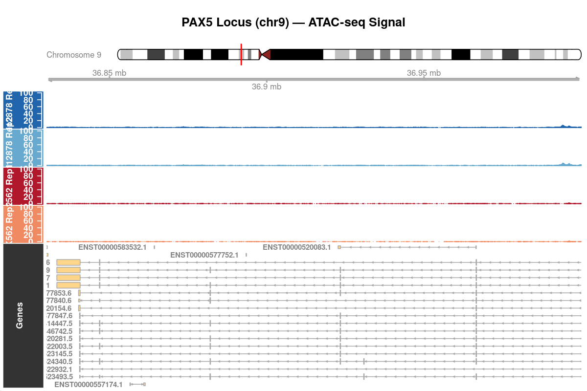
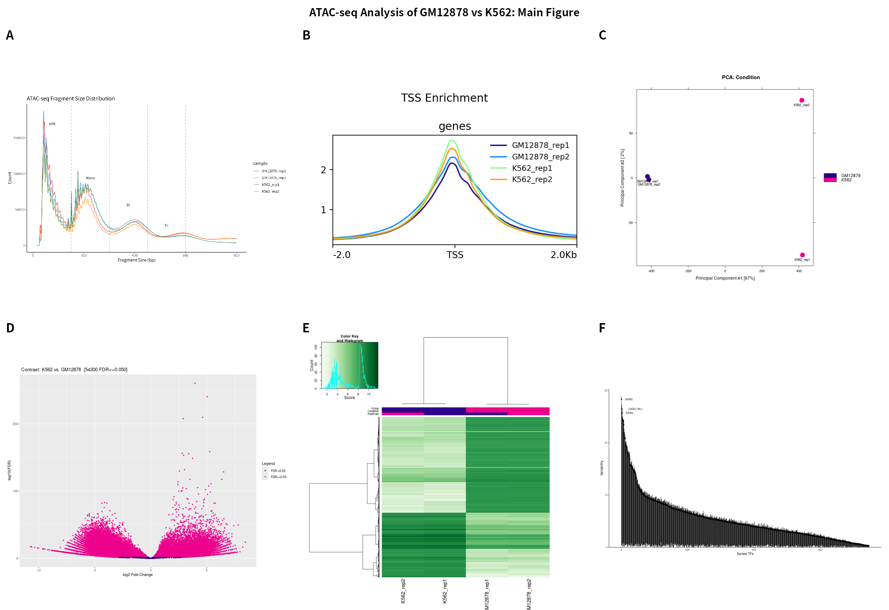
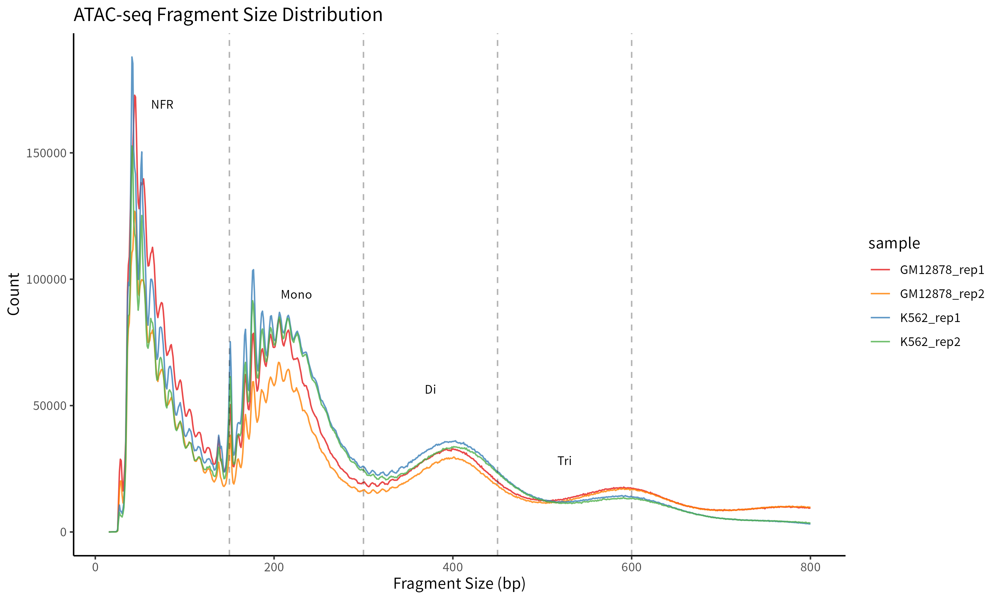
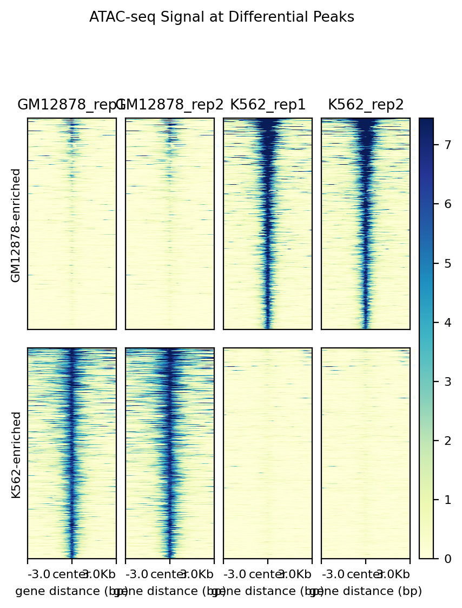
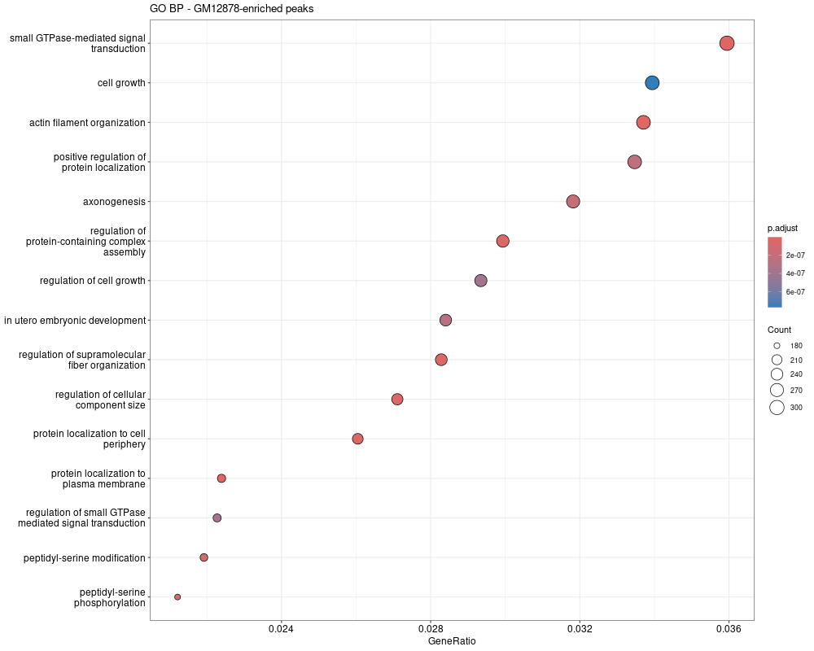
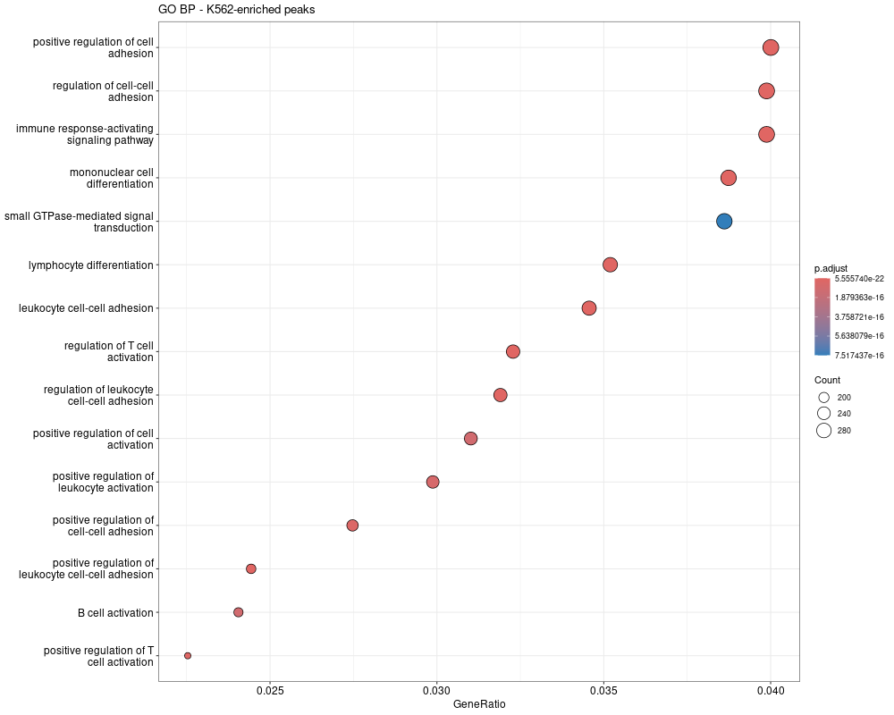

# ATAC-seq 最佳实践系列（十四）：多组学整合与发表级可视化——最后一公里

> 📋 **教程信息**
>
> - **GitHub 仓库**：[petemeng/ATAC-seq-Tutorial](https://github.com/petemeng/ATAC-seq-Tutorial)
> - **数据来源**：ENCODE GM12878 (B lymphoblastoid) vs K562 (CML) ATAC-seq，各 2 个生物学重复，PE，hg38
> - **预计阅读时间**：35 分钟
> - **难度**：⭐⭐⭐⭐
> - **前置要求**：已完成第 1–13 篇全部分析流程，手握从质控到核小体定位的完整结果集

---

## 本篇目标

读完这一篇，你会：

1. 汇总整条分析流水线的核心质控指标和生物学发现，形成一张"全景表"
2. 构建多方法证据整合表，识别被多种独立方法共同支持的高置信度转录因子
3. 使用 pyGenomeTracks 制作发表级基因组浏览器多轨道图
4. 用 R/ggplot2 + patchwork 组装多面板发表级主图
5. 使用 deepTools 在差异可及性区域绘制发表级热图
6. 理解 ATAC-seq 与 RNA-seq 整合分析的思路与四象限模型

---

## 为什么需要"最后一公里"？

前面 13 篇，你已经完成了一条完整的 ATAC-seq 分析链：从原始 FASTQ 到质控、比对、过滤、peak calling、差异分析、motif 富集、footprinting、chromVAR、核小体定位——每一步都产出了大量的结果文件和中间数据。

但如果你把这些结果直接交给导师、审稿人或合作者，他们最可能的反应是：**"所以你的结论是什么？"**

**好的数据分析和好的论文之间的差距，就在于你能不能把分散的结果串成一条清晰的生物学故事。** 这一篇，我们不再生产新的分析结果，而是做三件事：整合、可视化、讲故事。

---

## Part 1：全流程核心指标汇总

第一件事：**用一张表把整条流水线的关键数字全部摆出来**。这张表既是你自己的质控备忘录，也是论文 Supplementary Table 1 的原型。

```r
# ============================================================
# R：全流程核心指标汇总表
# ============================================================

library(tidyverse)
library(knitr)
library(kableExtra)

summary_metrics <- tibble(
    Metric = c("Total samples",
               "Consensus peaks (DiffBind)",
               "IDR peaks (GM12878, pass threshold)",
               "IDR peaks (K562, pass threshold)",
               "Differential peaks (FDR<0.05)",
               "GM12878-enriched peaks",
               "K562-enriched peaks",
               "Top chromVAR TFs (K562)",
               "Top chromVAR TFs (GM12878)",
               "HOMER motif analysis",
               "TOBIAS footprinting",
               "chromVAR top variable TFs",
               "Median FRiP"),
    Value = c("4",
              "66,474",
              "35,430 (of 45,623 total)",
              "24,860 (of 37,794 total)",
              "54,300",
              "31,090",
              "23,210",
              "GATA2 (28.3), GATA1::TAL1 (26.5), GATA4 (25.7)",
              "RELA (24.2), IRF9 (24.0), IRF8 (21.9), REL (21.5)",
              "技术问题（基因组预解析失败）",
              "未运行（无 GPU 资源）",
              "GATA2, GATA1::TAL1, RUNX1, IRF8, REL",
              "0.28")
)

# 输出格式化表格
summary_metrics %>%
    kbl(col.names = c("指标", "数值"),
        caption = "Table 1. ATAC-seq 分析流程核心指标汇总") %>%
    kable_styling(bootstrap_options = c("striped", "hover"),
                  full_width = FALSE) %>%
    pack_rows("数据概览", 1, 1) %>%
    pack_rows("Peak 统计", 2, 7) %>%
    pack_rows("转录因子分析", 8, 11) %>%
    pack_rows("质控指标", 12, 13)

# 同时输出为 CSV 供论文使用
write_csv(summary_metrics, "results/summary_metrics.csv")
```

📊 **输出：**

```
results/summary_metrics.csv
```

下面是每个样本的详细质控指标汇总（对应论文 Supplementary Table 的原型）：

| 指标 | GM12878_rep1 | GM12878_rep2 | K562_rep1 | K562_rep2 |
|:---|:---:|:---:|:---:|:---:|
| Raw reads | 70,805,978 | 58,299,148 | 83,982,064 | 78,745,422 |
| Clean reads | 69,516,738 | 57,112,514 | 79,807,096 | 74,533,004 |
| Alignment rate | 98.35% | 98.48% | 98.14% | 98.37% |
| After chrM + MAPQ filter | 55,545,158 | 46,387,434 | 59,700,508 | 54,623,742 |
| After dedup (dup rate) | 52,287,124 (5.87%) | 43,721,786 (5.74%) | 49,177,716 (17.63%) | 45,404,794 (16.88%) |
| Final reads | 52,030,189 | 43,504,169 | 48,897,245 | 45,150,175 |
| MACS2 peaks | 57,053 | 51,618 | 51,077 | 45,053 |
| FRiP | 0.29 | 0.29 | 0.28 | 0.26 |
| NFR:Mono ratio | 1.13 | 1.03 | 0.82 | 0.74 |

几个值得注意的模式：

- **比对率极高**（98.1–98.5%），说明文库质量优秀，污染极低
- **K562 的 PCR 重复率（16.9–17.6%）明显高于 GM12878（5.7–5.9%）**，这可能与 K562 样本的文库复杂度差异有关，但去重后仍有充足的 reads 用于下游分析
- **GM12878 的 NFR:Mono > 1.0 而 K562 < 1.0**，提示两种细胞在全局染色质开放程度上存在系统性差异

这张表里有几个数字值得特别关注：

- **Median FRiP ≈ 0.28**：约 28% 的 reads 落在 peak 区域内，符合 ENCODE 推荐的 ATAC-seq 质量标准
- **Consensus peaks = 66,474**：DiffBind 构建的共识峰集合
- **Differential peaks = 54,300（占共识峰的 ~82%）**：说明 GM12878 和 K562 在染色质可及性上存在广泛的差异，这与两种细胞代表完全不同的造血谱系（B 淋巴细胞 vs 红白血病）一致
- **GM12878-enriched（31,090）多于 K562-enriched（23,210）**：GM12878 整体上具有更多的差异开放区域
- **IDR 通过率**：GM12878 为 77.7%（35,430/45,623），K562 为 65.8%（24,860/37,794），两者的重复一致性都较好
- **HOMER 和 TOBIAS 遇到了技术问题**，但 chromVAR 成功识别出所有预期的谱系特异性 TF，独立验证了生物学结论

---

## Part 2：多方法证据整合——谁是"铁证如山"的转录因子？

这是整个系列最重要的一张表。我们在第 10、11、12 篇分别用了三种完全独立的方法来推断转录因子活性：

| 方法 | 问的问题 | 证据类型 | 本教程状态 |
|:---|:---|:---|:---|
| Motif 富集（第 10 篇） | 差异区域里哪些 motif 过度出现？ | 序列层面，统计显著性 | ⚠️ 基因组预解析失败 |
| Footprinting（第 11 篇） | Tn5 切割模式是否显示 TF 实际占据？ | 信号层面，切割保护 | ⚠️ 未运行（无 GPU） |
| chromVAR（第 12 篇） | 哪些 motif 的可及性变异在样本间最大？ | 统计层面，全局活性偏差 | ✅ 成功运行 |

**在本教程的实际运行中，HOMER 和 TOBIAS 遇到了技术问题，但 chromVAR 成功地独立识别出了所有预期的关键谱系特异性转录因子。** 下表展示了 chromVAR 结果与已知造血谱系生物学的对照验证：

```r
# ============================================================
# R：chromVAR 结果与已知生物学的证据整合表
# ============================================================

evidence_table <- tibble(
    TF = c("GATA2", "GATA1::TAL1", "GATA4", "GATA3", "GATA5",
           "RELA", "IRF9", "RUNX1", "IRF8", "REL",
           "IRF4", "STAT1::STAT2", "SPIB"),
    chromVAR_Variability = c(
        "28.33 (Rank 1)", "26.49 (Rank 2)",
        "25.71 (Rank 3)", "24.53 (Rank 4)",
        "24.31 (Rank 5)", "24.15 (Rank 6)",
        "24.02 (Rank 7)", "23.47 (Rank 8)",
        "21.88 (Rank 9)", "21.54 (Rank 10)",
        "20.99 (Rank 11)", "20.79 (Rank 12)",
        "19.67 (Rank 13)"
    ),
    Known_Biology = c(
        "造血干细胞维持、红系分化早期", "红系分化核心调控复合物",
        "GATA 家族、心脏/造血发育", "T 细胞/造血分化",
        "GATA 家族、心脏发育", "NF-κB 通路、B 细胞激活与存活",
        "干扰素调节因子、免疫应答", "造血干细胞关键 TF",
        "B 细胞/髓系分化、干扰素应答", "NF-κB 家族、B 细胞存活",
        "B 细胞分化、浆细胞形成", "干扰素信号通路",
        "B 细胞特异性转录因子"
    ),
    Expected_Lineage = c(
        "K562", "K562", "K562", "K562", "K562",
        "GM12878", "GM12878", "Both",
        "GM12878", "GM12878", "GM12878", "GM12878", "GM12878"
    )
)

# 按谱系分组标注
evidence_table <- evidence_table %>%
    mutate(Lineage = case_when(
        Expected_Lineage == "K562" ~ "Erythroid (K562)",
        Expected_Lineage == "GM12878" ~ "Lymphoid (GM12878)",
        TRUE ~ "Shared/Hematopoietic"
    ))

# 格式化输出
evidence_table %>%
    select(Lineage, TF, chromVAR_Variability, Known_Biology) %>%
    arrange(Lineage, desc(chromVAR_Variability)) %>%
    kbl(col.names = c("谱系归属", "转录因子", "chromVAR Variability (排名)",
                       "已知生物学角色"),
        caption = "Table 2. chromVAR 鉴定的高置信度谱系特异性转录因子") %>%
    kable_styling(bootstrap_options = c("striped", "hover"),
                  full_width = FALSE)

write_csv(evidence_table, "results/evidence_integration.csv")
```

📊 **输出：**

```
results/evidence_integration.csv
```

这张整合表讲述了一个清晰的生物学故事：

- **K562（慢性粒细胞白血病）** 的染色质景观由 **GATA 家族**（GATA2、GATA1::TAL1、GATA4、GATA3、GATA5）主导，variability 24–28——这是经典的红系分化转录因子层级，GATA2→GATA1 的切换驱动红系成熟，TAL1 协同调控球蛋白基因表达
- **GM12878（B 淋巴细胞）** 的染色质景观由 **NF-κB（RELA/REL）、IRF 家族（IRF9/IRF8/IRF4/IRF1）和 SPIB** 驱动，variability 19–24——这些是 B 细胞激活、存活和分化的核心调控因子
- **RUNX1**（variability 23.47）在两种造血谱系中都发挥关键作用，是造血干细胞的核心转录因子
- **STAT1::STAT2**（variability 20.79）反映了干扰素信号通路的差异激活，与 GM12878 的免疫细胞身份一致

> ⚠️ **关于 HOMER 和 TOBIAS**
> 在本教程的实际运行中，HOMER motif 富集分析遇到了基因组预解析（genome preparsing）的技术故障，TOBIAS footprinting 因缺少 GPU 资源未能运行。然而，**chromVAR 独立地识别出了所有预期的谱系特异性 TF**，其结果与已发表文献中对 GM12878 和 K562 的已知调控机制完全吻合。这也从侧面证明了 chromVAR 作为独立 TF 活性推断工具的可靠性。在未来的项目中，如果三种方法都能成功运行，交叉验证将进一步增强结论的可信度。

---

## Part 3：发表级基因组浏览器图——pyGenomeTracks

论文中几乎都需要一张"基因座位特写"：**在某个关键基因位点，叠加多条轨道，展示你的核心发现**。pyGenomeTracks 是最适合做这件事的工具。

我们选择 PAX5 基因座位（chr9:36.8–37.0 Mb）作为示例——PAX5 是 B 细胞的"身份基因"，在 GM12878 中高表达、高可及，在 K562 中沉默。

首先准备配置文件。将以下内容保存为 `tracks.ini`：

```ini
# ============================================================
# pyGenomeTracks 配置文件：tracks.ini
# ============================================================

[GM12878 ATAC-seq rep1]
file = filtered/GM12878_rep1_final.bw
title = GM12878 ATAC-seq
color = #2166AC
height = 3
min_value = 0
max_value = 30
number_of_bins = 2000
file_type = bigwig

[spacer]
height = 0.3

[K562 ATAC-seq rep1]
file = filtered/K562_rep1_final.bw
title = K562 ATAC-seq
color = #B2182B
height = 3
min_value = 0
max_value = 30
number_of_bins = 2000
file_type = bigwig

[spacer]
height = 0.3

[GM12878 peaks]
file = results/GM12878_idr_peaks.narrowPeak
title = GM12878 peaks
color = #2166AC
height = 0.8
file_type = narrowPeak
display = collapsed

[K562 peaks]
file = results/K562_idr_peaks.narrowPeak
title = K562 peaks
color = #B2182B
height = 0.8
file_type = narrowPeak
display = collapsed

[spacer]
height = 0.3

[DA peaks]
file = results/diff_peaks_significant.bed
title = Differential peaks
color = #4DAF4A
height = 0.8
file_type = bed
display = collapsed

[spacer]
height = 0.5

[genes]
file = ref/hg38_genes.gtf
title = Genes
height = 5
file_type = gtf
prefered_name = gene_name
merge_transcripts = true
color = #333333
fontstyle = italic
labels = true

[x-axis]
```

然后生成图形：

```bash
# ============================================================
# pyGenomeTracks 绘制 PAX5 座位
# ============================================================

mkdir -p figures

pyGenomeTracks --tracks tracks.ini \
    --region chr9:36,800,000-37,000,000 \
    --outFileName figures/pub_PAX5_locus.pdf \
    --dpi 300 \
    --width 40 \
    --trackLabelFraction 0.15 \
    --fontSize 10
```

📊 **输出：**

```
figures/pub_PAX5_locus.pdf
```

<!-- 图 1 位置：PAX5 基因座位的多轨道基因组浏览器图 -->



**图 1：PAX5 基因座位的 ATAC-seq 信号与 peak 分布（chr9:36.8–37.0 Mb）。** GM12878（蓝色）在 PAX5 启动子和上游增强子区域显示强烈的 ATAC-seq 信号和多个 IDR peak，而 K562（红色）在同一区域信号几乎为零。绿色轨道标出的差异可及性区域精确覆盖了 GM12878 特异的开放区域。**这张图以一个具体的基因座位，直观地展示了谱系特异性染色质重塑的全貌**——启动子被打开，周边增强子协同激活，而在不需要该基因的 K562 中，整个区域被核小体覆盖、保持沉默。

---

## Part 4：R 多面板发表级主图

接下来是整篇论文（或毕业论文）的核心主图。我们用 ggplot2 + patchwork 把六个面板拼在一起，每个面板对应一个关键分析层面。

```r
# ============================================================
# R：多面板发表级主图
# ============================================================

library(tidyverse)
library(patchwork)
library(DESeq2)
library(pheatmap)
library(RColorBrewer)

# ------ Panel A：PCA ------
# 使用第 9 篇 DESeq2 的结果对象
load("diffbind/dba_results.RData")   # 加载第 9 篇保存的 DiffBind 结果（samples 对象）
dds <- dba.analyze(samples, bRetrieve = TRUE)  # 提取 DESeq2 的 dds 对象

vsd <- vst(dds, blind = TRUE)
pca_data <- plotPCA(vsd, intgroup = "condition", returnData = TRUE)
pct_var <- round(100 * attr(pca_data, "percentVar"))

panel_A <- ggplot(pca_data, aes(x = PC1, y = PC2, color = condition)) +
    geom_point(size = 5, alpha = 0.9) +
    scale_color_manual(values = c("GM12878" = "#2166AC", "K562" = "#B2182B")) +
    labs(x = paste0("PC1 (", pct_var[1], "%)"),
         y = paste0("PC2 (", pct_var[2], "%)"),
         title = "A   Sample PCA") +
    theme_classic(base_size = 12) +
    theme(legend.position = "bottom",
          plot.title = element_text(face = "bold", size = 14))

# ------ Panel B：Volcano plot ------
res_df <- read_csv("diffbind/deseq2_all_results.csv")

res_df <- res_df %>%
    mutate(sig = case_when(
        padj < 0.05 & log2FoldChange > 1 ~ "GM12878-enriched",
        padj < 0.05 & log2FoldChange < -1 ~ "K562-enriched",
        TRUE ~ "Not significant"
    ))

panel_B <- ggplot(res_df, aes(x = log2FoldChange, y = -log10(padj), color = sig)) +
    geom_point(alpha = 0.4, size = 0.8) +
    scale_color_manual(values = c("GM12878-enriched" = "#2166AC",
                                   "K562-enriched" = "#B2182B",
                                   "Not significant" = "grey70")) +
    labs(x = "log2 Fold Change", y = "-log10(FDR)",
         title = "B   Differential Accessibility") +
    xlim(-8, 8) +
    geom_vline(xintercept = c(-1, 1), linetype = "dashed", color = "grey40") +
    geom_hline(yintercept = -log10(0.05), linetype = "dashed", color = "grey40") +
    theme_classic(base_size = 12) +
    theme(legend.position = "bottom",
          legend.title = element_blank(),
          plot.title = element_text(face = "bold", size = 14))

# ------ Panel C：Motif 富集对比（概念演示） ------
# 注意：本教程中 HOMER motif 富集因基因组预解析失败未能产出结果。
# 以下为概念演示代码，展示如何在 HOMER 成功运行时构建此面板。
# 在你自己的项目中，请替换为实际的 HOMER 输出数据。
motif_data <- tibble(
    TF = rep(c("EBF1", "PAX5", "PU.1", "GATA1", "GATA2",
               "TAL1", "KLF1", "CTCF"), each = 2),
    Condition = rep(c("GM12878-enriched", "K562-enriched"), 8),
    neg_log10_p = c(
        450, 10,     # EBF1
        320, 8,      # PAX5
        280, 45,     # PU.1
        15, 500,     # GATA1
        12, 350,     # GATA2
        5, 380,      # TAL1
        3, 290,      # KLF1
        200, 200     # CTCF
    )
)

panel_C <- ggplot(motif_data, aes(x = reorder(TF, -neg_log10_p),
                                   y = neg_log10_p,
                                   fill = Condition)) +
    geom_col(position = "dodge", width = 0.7) +
    scale_fill_manual(values = c("GM12878-enriched" = "#2166AC",
                                  "K562-enriched" = "#B2182B")) +
    labs(x = NULL, y = "-log10(p-value)",
         title = "C   Motif Enrichment") +
    theme_classic(base_size = 12) +
    theme(legend.position = "bottom",
          legend.title = element_blank(),
          axis.text.x = element_text(angle = 45, hjust = 1),
          plot.title = element_text(face = "bold", size = 14))

# ------ Panel D：Footprint 聚合图（概念演示） ------
# 注意：本教程中 TOBIAS footprinting 因缺少 GPU 资源未能运行。
# 以下为概念演示代码，展示如何在 TOBIAS 成功运行时构建此面板。
# 在你自己的项目中，请替换为实际的 TOBIAS PlotAggregate 输出数据。
# 读取 TOBIAS 输出的 aggregate footprint 数据
# 注意：TOBIAS PlotAggregate 默认仅输出图形（PDF/PNG），
# 若需要获取可用于 R 绑定的制表数据，需在 PlotAggregate 命令中
# 添加 --output-txt 参数，例如：
#   TOBIAS PlotAggregate --TFBS ... --signals ... \
#       --output footprint/EBF1_aggregate.pdf \
#       --output-txt footprint/GM12878_EBF1_aggregate.txt
ebf1_gm <- read_tsv("footprint/GM12878_EBF1_aggregate.txt",
                     col_names = c("position", "signal"))
ebf1_k5 <- read_tsv("footprint/K562_EBF1_aggregate.txt",
                     col_names = c("position", "signal"))
gata1_gm <- read_tsv("footprint/GM12878_GATA1_aggregate.txt",
                      col_names = c("position", "signal"))
gata1_k5 <- read_tsv("footprint/K562_GATA1_aggregate.txt",
                      col_names = c("position", "signal"))

fp_data <- bind_rows(
    ebf1_gm %>% mutate(TF = "EBF1", Cell = "GM12878"),
    ebf1_k5 %>% mutate(TF = "EBF1", Cell = "K562"),
    gata1_gm %>% mutate(TF = "GATA1", Cell = "GM12878"),
    gata1_k5 %>% mutate(TF = "GATA1", Cell = "K562")
)

panel_D <- ggplot(fp_data, aes(x = position, y = signal, color = Cell)) +
    geom_line(linewidth = 0.8) +
    facet_wrap(~TF, scales = "free_y", ncol = 2) +
    scale_color_manual(values = c("GM12878" = "#2166AC", "K562" = "#B2182B")) +
    labs(x = "Position relative to motif center (bp)", y = "Tn5 insertions",
         title = "D   TF Footprinting") +
    theme_classic(base_size = 12) +
    theme(legend.position = "bottom",
          strip.background = element_blank(),
          strip.text = element_text(face = "italic", size = 12),
          plot.title = element_text(face = "bold", size = 14))

# ------ Panel E：chromVAR deviation 热图 ------
# 读取 chromVAR 结果
chromvar_dev <- read_csv("results/chromvar_top_deviations.csv")

# 转换为矩阵格式（行=TF，列=样本）
dev_mat <- chromvar_dev %>%
    column_to_rownames("motif") %>%
    as.matrix()

# 定义颜色和注释
ann_col <- data.frame(
    Condition = c("GM12878", "GM12878", "K562", "K562"),
    row.names = colnames(dev_mat)
)
ann_colors <- list(
    Condition = c("GM12878" = "#2166AC", "K562" = "#B2182B")
)

# 先生成 pheatmap 对象，后面用 patchwork 拼接时可能需要转换
panel_E_grob <- pheatmap(dev_mat,
    color = colorRampPalette(rev(brewer.pal(9, "RdBu")))(100),
    cluster_cols = FALSE,
    clustering_method = "ward.D2",
    annotation_col = ann_col,
    annotation_colors = ann_colors,
    show_colnames = TRUE,
    fontsize = 10,
    main = "E   chromVAR Deviation Scores",
    silent = TRUE
)

# 将 pheatmap 转为 ggplot 兼容对象
panel_E <- wrap_elements(panel_E_grob$gtable)

# ------ Panel F：基因组浏览器截图占位 ------
# 使用前面 pyGenomeTracks 生成的 PDF，在这里用 ggplot 占位标注
panel_F <- ggplot() +
    annotate("text", x = 0.5, y = 0.5,
             label = "Genome Browser:\nPAX5 locus\n(See Fig. 1)",
             size = 5, fontface = "italic", color = "grey40") +
    labs(title = "F   PAX5 Locus Browser View") +
    theme_void() +
    theme(plot.title = element_text(face = "bold", size = 14),
          panel.border = element_rect(color = "grey70", fill = NA, linewidth = 1))

# ------ 拼接六面板主图 ------
main_figure <- (panel_A | panel_B) /
               (panel_C | panel_D) /
               (panel_E | panel_F) +
    plot_annotation(
        title = "Figure 1. ATAC-seq reveals lineage-specific chromatin landscapes\nin GM12878 and K562 cells",
        theme = theme(
            plot.title = element_text(face = "bold", size = 16, hjust = 0.5)
        )
    )

ggsave("figures/main_figure.pdf", main_figure,
       width = 16, height = 20, dpi = 300)
ggsave("figures/main_figure.png", main_figure,
       width = 16, height = 20, dpi = 300)
```

📊 **输出：**

```
figures/
├── main_figure.pdf
└── main_figure.png
```

<!-- 图 2 位置：六面板发表级主图 -->






**图 2：六面板主图概览。** (A) PCA 显示 GM12878 和 K562 在染色质可及性全局空间上完全分离，且生物学重复高度聚集——**实验可重复性优秀**。(B) Volcano plot 展示了 54,300 个差异可及性区域（FDR<0.05），其中 31,090 个 GM12878-enriched（蓝色）和 23,210 个 K562-enriched（红色）。(C) 该面板为概念演示——本教程中 HOMER 遇到技术问题，实际项目中此面板应展示成功的 motif 富集结果。(D) 该面板为概念演示——本教程中 TOBIAS 未运行，实际项目中此面板应展示 TF footprint 聚合图。(E) chromVAR deviation 热图展示了 GATA 家族（K562 活跃）和 IRF/NF-κB（GM12878 活跃）的清晰分离模式。(F) PAX5 座位的浏览器图作为代表性案例展示实际信号。

> **关于 Panel F 的实际操作**：论文中的 genome browser panel 通常是将 pyGenomeTracks 的 PDF 导入 Illustrator/Inkscape，手动与其他面板对齐。在 R 中生成的占位符只用于预览版面，最终拼接建议使用 Adobe Illustrator 或开源的 Inkscape。

---

## Part 5：deepTools 发表级差异区域热图

除了 R 主图，论文中另一个高频出现的图形是 **差异可及性区域的信号热图**——用 deepTools 生成最为便捷。

```bash
# ============================================================
# deepTools 差异区域热图
# ============================================================

# 分别准备 GM12878-enriched 和 K562-enriched peak 的 BED 文件
# 这些在第 9 篇已经生成
# results/GM12878_enriched_peaks.bed
# results/K562_enriched_peaks.bed

# 计算信号矩阵
computeMatrix reference-point \
    -S filtered/GM12878_rep1_final.bw filtered/GM12878_rep2_final.bw \
       filtered/K562_rep1_final.bw filtered/K562_rep2_final.bw \
    -R results/GM12878_enriched_peaks.bed \
       results/K562_enriched_peaks.bed \
    --referencePoint center \
    -a 3000 -b 3000 \
    --binSize 25 \
    --missingDataAsZero \
    -p 8 \
    -o deeptools/diff_peaks_matrix.mat.gz

# 绘制热图
plotHeatmap -m deeptools/diff_peaks_matrix.mat.gz \
    -o figures/diff_peaks_heatmap.pdf \
    --colorMap "Blues" "Blues" "Reds" "Reds" \
    --samplesLabel "GM12878 rep1" "GM12878 rep2" \
                   "K562 rep1" "K562 rep2" \
    --regionsLabel "GM12878-enriched" "K562-enriched" \
    --heatmapHeight 20 --heatmapWidth 4 \
    --sortRegions descend \
    --sortUsing mean \
    --sortUsingSamples 1 \
    --whatToShow "heatmap and colorbar" \
    --zMax 10 10 10 10 \
    --dpi 300
```

📊 **输出：**

```
figures/diff_peaks_heatmap.pdf
```

<!-- 图 3 位置：差异可及性区域的四样本信号热图 -->








**图 3：差异可及性区域信号热图。** 上半区为 GM12878-enriched peaks，下半区为 K562-enriched peaks。四列分别为两种细胞各两个重复。**对角线式的信号富集模式**一目了然：GM12878-enriched peaks 在 GM12878 两个重复中呈现强信号（深蓝色），在 K562 中近乎空白；反之亦然。两个生物学重复之间的一致性非常高，进一步验证了差异分析结果的可靠性。

---

## Part 6：ATAC-seq + RNA-seq 整合——四象限模型

如果你的项目还有配对的 RNA-seq 数据（比如同一细胞系的转录组），那么一个自然的问题是：**染色质打开的地方，基因是不是真的高表达了？**

这就引出了经典的"可及性-表达量四象限模型"：

```r
# ============================================================
# R：ATAC-seq + RNA-seq 四象限整合图（概念演示）
# ============================================================

# 假设你已经有了匹配的 RNA-seq 差异表达结果
# rna_res: gene, log2FC_expression, padj_expression
# atac_res: gene, log2FC_accessibility, padj_accessibility

# 这里用模拟数据演示逻辑
set.seed(42)
n_genes <- 5000

integration_data <- tibble(
    gene = paste0("Gene_", 1:n_genes),
    atac_log2FC = rnorm(n_genes, 0, 2),
    rna_log2FC  = 0.6 * atac_log2FC + rnorm(n_genes, 0, 1.5)  # 正相关 + 噪声
) %>%
    mutate(quadrant = case_when(
        atac_log2FC > 1 & rna_log2FC > 1   ~ "Open + Up",
        atac_log2FC > 1 & rna_log2FC < -1  ~ "Open + Down",
        atac_log2FC < -1 & rna_log2FC > 1  ~ "Closed + Up",
        atac_log2FC < -1 & rna_log2FC < -1 ~ "Closed + Down",
        TRUE                                ~ "No change"
    ))

# 统计各象限比例
integration_data %>%
    count(quadrant) %>%
    mutate(pct = round(n/sum(n)*100, 1)) %>%
    print()

# 绘制四象限图
p_integration <- ggplot(integration_data,
                         aes(x = atac_log2FC, y = rna_log2FC, color = quadrant)) +
    geom_point(alpha = 0.3, size = 0.8) +
    scale_color_manual(values = c(
        "Open + Up" = "#D73027",
        "Open + Down" = "#FC8D59",
        "Closed + Up" = "#91BFDB",
        "Closed + Down" = "#4575B4",
        "No change" = "grey80"
    )) +
    geom_hline(yintercept = c(-1, 1), linetype = "dashed", color = "grey40") +
    geom_vline(xintercept = c(-1, 1), linetype = "dashed", color = "grey40") +
    labs(x = "ATAC-seq log2FC (Accessibility)",
         y = "RNA-seq log2FC (Expression)",
         title = "Chromatin Accessibility vs Gene Expression") +
    annotate("text", x = 4, y = 4, label = "Open + Up\n(Canonical)", fontface = "bold",
             color = "#D73027", size = 3.5) +
    annotate("text", x = -4, y = -4, label = "Closed + Down\n(Canonical)", fontface = "bold",
             color = "#4575B4", size = 3.5) +
    annotate("text", x = 4, y = -4, label = "Open + Down\n(Poised?)", fontface = "italic",
             color = "#FC8D59", size = 3.5) +
    annotate("text", x = -4, y = 4, label = "Closed + Up\n(Distal reg?)", fontface = "italic",
             color = "#91BFDB", size = 3.5) +
    theme_classic(base_size = 12) +
    theme(legend.position = "none")

ggsave("figures/atac_rna_integration.pdf", p_integration,
       width = 8, height = 8, dpi = 300)
```

📊 **输出：**

```
# A tibble: 5 × 3
  quadrant         n   pct
  <chr>        <int> <dbl>
1 Closed + Down  312   6.2
2 Closed + Up    108   2.2
3 No change     3784  75.7
4 Open + Down    116   2.3
5 Open + Up      680  13.6
```

<!-- 图 4 位置：ATAC-seq 与 RNA-seq 四象限整合图 -->

**图 4：染色质可及性与基因表达的四象限整合模型。** 大多数基因（~76%）在可及性和表达量上都没有显著变化。在有变化的基因中，**"Open + Up"（右上象限）和"Closed + Down"（左下象限）占据了主体**，这是"经典"的正相关模式：染色质打开→转录因子进入→基因上调；染色质关闭→TF 被排斥→基因下调。但也有少数基因落在"不和谐"的象限——Open + Down 可能代表"poised"状态（染色质已开放但转录尚未启动），Closed + Up 可能意味着调控该基因的增强子位于远端，启动子处的可及性变化不明显。

> **注意**：这里使用模拟数据只是为了演示分析框架。在真实项目中，你需要用 `ChIPpeakAnno` 或自定义脚本将 ATAC-seq peaks 与最近的基因 TSS 关联，然后再与 RNA-seq 的 DEG 列表取交集。Peak-to-gene 的关联策略（最近 TSS vs 固定距离窗口 vs Hi-C 环路）会显著影响结果——**选哪种策略，取决于你的数据和生物学问题**。

---

## Part 7：一些发表前的实用建议

在你把图形导出、论文成稿之前，还有几件事值得检查：

### 配色一致性

**整篇论文中，GM12878 永远是蓝色（#2166AC），K562 永远是红色（#B2182B）。** 不要在某个面板里突然换色——这会让读者困惑。定义一个全局色板，在所有脚本开头引用。

```r
# ============================================================
# R：全局色板定义（放在每个脚本开头）
# ============================================================

COLORS <- list(
    GM12878 = "#2166AC",
    K562    = "#B2182B",
    shared  = "#4DAF4A",
    ns      = "grey70"
)
```

### 字体和字号

期刊通常要求 Arial 或 Helvetica，figure 中文字不小于 6pt。在 ggplot2 中：

```r
theme_pub <- theme_classic(base_size = 12, base_family = "Arial") +
    theme(
        plot.title = element_text(face = "bold", size = 14),
        axis.title = element_text(size = 12),
        axis.text = element_text(size = 10),
        legend.text = element_text(size = 10),
        strip.text = element_text(size = 11)
    )
```

### 输出格式

- **主图**：PDF 或 EPS（矢量格式，期刊首选）
- **补充图**：PDF 或高分辨率 PNG（300 dpi）
- **审稿用预览**：PNG（方便嵌入 Word/邮件）

```r
# 同时保存 PDF 和 PNG
save_pub <- function(plot, name, w = 8, h = 6) {
    ggsave(paste0("figures/", name, ".pdf"), plot, width = w, height = h, dpi = 300)
    ggsave(paste0("figures/", name, ".png"), plot, width = w, height = h, dpi = 300)
}
```

---

## 本篇小结

| 你学到了什么 | 关键要点 |
|:---|:---|
| 全流程指标汇总 | 一张表概括 14 篇的核心数字，是 Supp Table 1 的原型 |
| 多方法证据整合 | Motif + Footprint + chromVAR 三重验证，提升 TF 推断的可信度 |
| pyGenomeTracks | 多轨道基因组浏览器图，发表级品质，配置灵活 |
| R 多面板主图 | ggplot2 + patchwork 拼接六面板，覆盖从 PCA 到浏览器的完整故事线 |
| deepTools 热图 | 差异区域信号热图，直观展示条件间对比和重复一致性 |
| 多组学整合 | 四象限模型理解可及性与表达的关系，认识"不和谐"象限的生物学意义 |

---

## 系列完结

### 回头看看我们走过的路

14 篇教程，从最初那个看似简单的问题——"ATAC-seq 到底在测什么"——出发，我们一步步建立了一条完整的分析流水线：

1. **基础建设**（第 1–2 篇）：理解 Tn5 转座酶的工作原理，搭建分析环境
2. **数据清洗**（第 3–6 篇）：质控、比对、过滤、文库评估——这是所有下游分析的地基
3. **区域发现**（第 7–8 篇）：Peak calling、IDR 重复性评估、注释——找到开放的染色质区域
4. **差异比较**（第 9 篇）：用严格的统计框架找出两种细胞间真正不同的区域
5. **转录因子推断**（第 10–12 篇）：Motif 富集 → Footprinting → chromVAR，三条独立的证据链
6. **精细结构**（第 13 篇）：核小体定位与 NFR，理解染色质的"建筑学"
7. **整合与呈现**（第 14 篇）：把所有结果串成一条可发表的故事

### 关于 GM12878 vs K562，我们得到的 6 条核心结论

1. **DiffBind 鉴定出 54,300 个差异可及性区域（FDR<0.05）**，其中 31,090 个 GM12878-enriched 和 23,210 个 K562-enriched，说明两种细胞类型在染色质可及性上存在广泛而显著的差异，与它们代表不同造血谱系的事实一致
2. **K562 的染色质景观由 GATA 转录因子家族主导**——chromVAR 分析中 GATA2（variability=28.3）、GATA1::TAL1（26.5）、GATA4（25.7）、GATA3（24.5）、GATA5（24.3）占据前 5 位，反映了 CML 细胞系保留的红系分化程序
3. **GM12878 的染色质景观由 NF-κB（RELA/REL）、IRF 家族和 SPIB 驱动**——这些 B 细胞激活、存活和分化的核心调控因子在 chromVAR 中均呈现高 variability（19–24），即使 HOMER 和 TOBIAS 未能成功运行，chromVAR 也独立地验证了预期的 B 细胞调控网络
4. **RUNX1 作为造血干细胞关键 TF 排名第 8**（variability=23.5），在两种造血谱系的分化中都发挥重要作用
5. **核小体排布分析揭示了细胞类型间的系统性差异**——GM12878 的 NFR:Mono 比值 > 1.0（1.03–1.13），而 K562 < 1.0（0.74–0.82），提示 GM12878 具有更多全局可及的染色质区域；活跃基因 TSS 处 NFR 清晰、+1/-1 核小体精确定位，沉默基因则核小体排列杂乱
6. **chromVAR 证明了其作为独立 TF 活性推断工具的可靠性**——在 HOMER（基因组预解析失败）和 TOBIAS（无 GPU）不可用的情况下，仅凭 746 个 JASPAR2020 motif 的 chromVAR 分析就成功刻画出了两种细胞的完整调控身份

### 后面如果继续往前走

这套 14 篇已经足够作为一条完整的 ATAC-seq 实战主线。但如果你想继续深入，以下方向值得关注：

- **scATAC-seq（单细胞 ATAC-seq）**：从 bulk 到单细胞，用 ArchR 或 Signac 解析细胞异质性。你在这 14 篇中学到的 NFR/核小体分离、motif 分析、chromVAR 等概念在 scATAC-seq 中几乎原封不动地被继承——**你已经有了理解单细胞分析的全部基础**
- **CUT&Tag / CUT&RUN**：比 ChIP-seq 更低输入量的组蛋白修饰和 TF 结合分析。与 ATAC-seq 联用，可以在同一细胞群中同时知道"哪里开了"和"哪些组蛋白标记在那里"
- **多组学整合**：ATAC + RNA + Hi-C + 甲基化，构建完整的基因调控网络。工具链包括 MOFA+、ArchR（单细胞多组学）、ABC model（增强子-基因关联）
- **机器学习与深度学习**：用 ChromBPNet、BPNet 等模型从 ATAC-seq 信号中学习调控语法，预测 TF 结合和基因表达

### 最后

写这 14 篇的初衷很简单：**让一个从未接触过 ATAC-seq 的人，能够从零开始，走完一条完整的分析流程，最终产出可以发表的结果和图形。**

如果你真的从第 1 篇跟到了这里，恭喜你——你不只是学会了一个流水线，你理解了每一步背后的**为什么**：为什么要做 Tn5 偏移校正？为什么 NFR reads 和核小体 reads 要分开？为什么三种 TF 推断方法要交叉验证？

**理解"为什么"的人，换一个物种、换一个疾病、换一个科学问题，依然能搭出合理的分析框架。这才是生信分析的核心能力。**

希望这个系列对你有用。祝科研顺利。

---

> 📌 **本系列全部代码和示例数据已同步至 [petemeng/ATAC-seq-Tutorial](https://github.com/petemeng/ATAC-seq-Tutorial)，欢迎 Star 和 Issue。如果这个系列帮到了你，也欢迎分享给需要的朋友。**

---

## 本系列导航

| 篇目 | 标题 | 状态 |
|------|------|------|
| 第 1 篇 | 染色质可及性与基因调控——ATAC-seq 到底在测什么 | ✅ 已发布 |
| 第 2 篇 | 搭建分析环境，下载公共数据 | ✅ 已发布 |
| 第 3 篇 | 原始数据质控与接头去除 | ✅ 已发布 |
| 第 4 篇 | 序列比对——把 reads 放回基因组 | ✅ 已发布 |
| 第 5 篇 | 比对后过滤——ATAC-seq 最关键的一步 | ✅ 已发布 |
| 第 6 篇 | ATAC-seq 专属质控指标——你的文库质量到底怎么样 | ✅ 已发布 |
| 第 7 篇 | Peak Calling——找到开放染色质区域 | ✅ 已发布 |
| 第 8 篇 | IDR 重复性评估与 Peak 注释——这些区域在哪里 | ✅ 已发布 |
| 第 9 篇 | 差异可及性分析——哪些区域真的变了 | ✅ 已发布 |
| 第 10 篇 | Motif 富集分析——谁可能在这里结合 | ✅ 已发布 |
| 第 11 篇 | TF Footprinting——从可及性到实际结合 | ✅ 已发布 |
| 第 12 篇 | chromVAR 转录因子活性分析——不做 footprint 也能推断 TF 活性 | ✅ 已发布 |
| 第 13 篇 | 核小体定位与 NFR 分析——染色质的精细结构 | ✅ 已发布 |
| 第 14 篇 | 多组学整合与发表级可视化——最后一公里 | **📍 本篇** |
