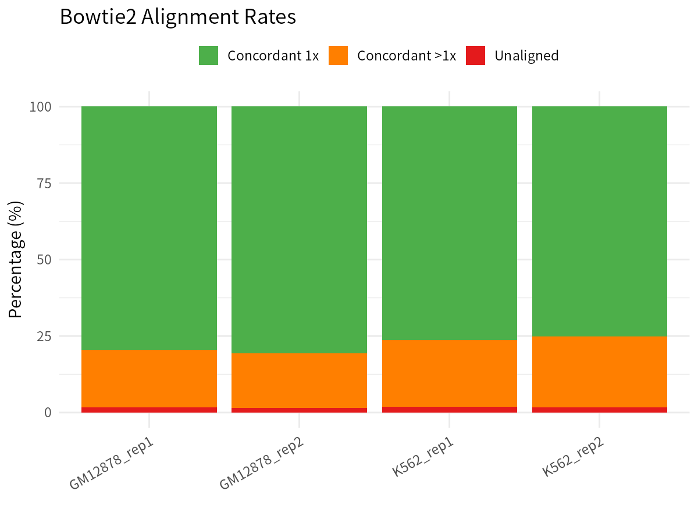

# ATAC-seq 最佳实践系列（四）：序列比对——把 reads 放回基因组

> 📋 **教程信息**
>
> - **GitHub 仓库**：[petemeng/ATAC-seq-Tutorial](https://github.com/petemeng/ATAC-seq-Tutorial)
> - **数据来源**：ENCODE GM12878 (B 淋巴母细胞系) vs K562 (慢性髓系白血病细胞系) ATAC-seq
> - **预计阅读**：25 分钟 | **实操**：40–60 分钟（取决于计算资源）
> - **难度**：⭐⭐
> - **前置知识**：第 3 篇完成的 clean reads；了解 FASTQ/BAM 格式；Linux 命令行基础

---

## 本篇目标

经过前一篇的质控和接头去除，你手上已经有了四个样本的干干净净的 FASTQ 文件。但 FASTQ 里只有一条条"悬浮"的序列——你不知道它们来自基因组的哪个位置，也无法判断哪里的染色质是开放的。**比对（alignment），就是把这些 reads 放回它们在基因组上的位置。** 这一步是后续所有分析——从 peak calling 到 motif 分析——的地基。地基没打好，上层建筑全白搭。

读完这一篇，你会：

1. 理解为什么 ATAC-seq 通常选择 Bowtie2 而不是 BWA-MEM 作为比对工具
2. 掌握 Bowtie2 参考基因组索引的构建（或下载预构建索引）
3. 使用针对 ATAC-seq 优化的参数完成序列比对
4. 解读比对日志和 `samtools flagstat` 输出，评估比对质量
5. 编写批量比对脚本，一次性处理所有样本

---

## 为什么 ATAC-seq 用 Bowtie2？

你可能听说过 BWA-MEM 是 DNA-seq 比对的"默认选择"，那为什么 ATAC-seq 领域几乎清一色地用 Bowtie2？原因有三：

**1. 片段长度的特殊性。** ATAC-seq 的片段长度跨度极大——从 <100 bp 的 NFR（无核小体区）片段到 600–800 bp 的三核小体片段都有。Bowtie2 的 `-X` 参数可以灵活设定最大插入片段长度，确保这些长片段也能被正确地以 concordant pair 方式比对。

**2. 对短片段的处理更稳健。** ATAC-seq 中 NFR 片段经常短于 150 bp，有时甚至只有 50-80 bp。Bowtie2 的端到端（end-to-end）比对模式对这些短片段的处理非常稳定。BWA-MEM 本质是一个局部比对器，对极短 reads 有时会给出"软裁剪"（soft-clip），这可能影响后续的 Tn5 切割位点推断。

**3. 社区标准与可重复性。** ENCODE、Harvard FAS Informatics、nf-core/atacseq 等主流 pipeline 全部使用 Bowtie2。选择同样的工具意味着你的结果可以直接与公共数据集比较，审稿人也不会质疑你的方法学选择。

💡 **BWA-MEM 不是不能用**
> 实际上 BWA-MEM 也完全可以完成 ATAC-seq 比对，许多实验室也这样做。但如果你没有特殊理由（比如需要和 WGS 数据用相同流程），**建议跟随社区主流选择 Bowtie2**，减少审稿和比较时的麻烦。

---

## 第一步：准备参考基因组索引

Bowtie2 比对之前，需要先把参考基因组建成索引。你有两个选择：

### 方案一：下载预构建索引（推荐）

NCBI 和 Bowtie2 官方都提供了 hg38 的预构建索引，直接下载最省时间：

```bash
# ============================================================
# 下载 Bowtie2 预构建的 hg38 索引，省去 ~1 小时的索引构建时间
# ============================================================
mkdir -p reference/bowtie2_index && cd reference/bowtie2_index

# 从 NCBI 下载（约 3.5 GB）
wget https://genome-idx.s3.amazonaws.com/bt2/GRCh38_noalt_as.zip
unzip GRCh38_noalt_as.zip
cd ../..
```

💡 **为什么用 noalt 版本？**
> hg38 基因组包含大量 ALT contig（替代序列）。在 ATAC-seq 分析中，这些 ALT contig 会导致 reads 多重比对，增加噪音。**使用不含 ALT contig 的版本（noalt）可以减少歧义比对，获得更干净的结果。**

### 方案二：从 FASTA 自行构建索引

如果你的参考基因组版本特殊，或者网络条件不允许下载，可以自行构建：

```bash
# ============================================================
# 从 FASTA 文件构建 Bowtie2 索引（耗时 ~60 分钟，内存 ~4 GB）
# ============================================================
mkdir -p reference/bowtie2_index

bowtie2-build --threads 8 \
    ref/hg38.fa \
    reference/bowtie2_index/GRCh38_noalt_as

# 构建完成后会生成 6 个文件：
# hg38.1.bt2, hg38.2.bt2, hg38.3.bt2, hg38.4.bt2, hg38.rev.1.bt2, hg38.rev.2.bt2
```

```
📊 输出：
Building a SMALL://  index
Total time for call to driver() for forward index: 00:52:14
Total time for call to driver() for mirror index: 00:48:37
```

确认索引文件存在：

```bash
# ============================================================
# 检查索引文件是否完整（应有 6 个 .bt2 文件）
# ============================================================
ls -lh reference/bowtie2_index/GRCh38_noalt_as*.bt2
```

```
📊 输出：
-rw-r--r-- 1 user user 886M Apr 10 09:12 reference/bowtie2_index/GRCh38_noalt_as.1.bt2
-rw-r--r-- 1 user user 660M Apr 10 09:12 reference/bowtie2_index/GRCh38_noalt_as.2.bt2
-rw-r--r-- 1 user user  52K Apr 10 09:12 reference/bowtie2_index/GRCh38_noalt_as.3.bt2
-rw-r--r-- 1 user user 660M Apr 10 09:12 reference/bowtie2_index/GRCh38_noalt_as.4.bt2
-rw-r--r-- 1 user user 886M Apr 10 09:34 reference/bowtie2_index/GRCh38_noalt_as.rev.1.bt2
-rw-r--r-- 1 user user 660M Apr 10 09:34 reference/bowtie2_index/GRCh38_noalt_as.rev.2.bt2
```

---

## 第二步：Bowtie2 比对——逐行拆解参数

准备好索引后，就可以开始比对了。我们先用一个样本演示完整命令，然后逐个解释参数：

```bash
# ============================================================
# 用 Bowtie2 比对单个样本，管道接 samtools 排序生成 BAM
# ============================================================
mkdir -p alignment logs

bowtie2 --very-sensitive -X 2000 --no-mixed --no-discordant \
    --threads 8 -x reference/bowtie2_index/GRCh38_noalt_as \
    -1 clean_data/GM12878_rep1_R1_clean.fastq.gz \
    -2 clean_data/GM12878_rep1_R2_clean.fastq.gz \
    2> logs/GM12878_rep1_bowtie2.log | \
    samtools sort -@ 8 -O BAM -o alignment/GM12878_rep1.bam

samtools index alignment/GM12878_rep1.bam
```

这条命令干了两件事：① Bowtie2 把 reads 比对到参考基因组，② samtools 接收 Bowtie2 的 SAM 输出，按坐标排序后存为 BAM。下面逐个拆解关键参数：

### 参数详解

| 参数 | 含义 | 为什么 ATAC-seq 需要它 |
|------|------|------------------------|
| `--very-sensitive` | 使用最灵敏的比对模式（-D 20 -R 3 -N 0 -L 20 -i S,1,0.50） | ATAC-seq 的 reads 来自开放染色质区，序列复杂度高，灵敏模式能找到更多真实比对，代价是速度稍慢 |
| `-X 2000` | 允许的最大插入片段长度设为 2000 bp | **这是 ATAC-seq 最重要的参数！** 默认值 500 bp 会丢掉所有二核小体（~400 bp）和三核小体（~600 bp）片段。设为 2000 可以捕获所有生物学意义上的片段 |
| `--no-mixed` | 不允许 read1 和 read2 独立比对 | ATAC-seq 的双端 reads 应该来自同一个 Tn5 切割事件，如果只有一端能比上，说明这对 reads 有问题 |
| `--no-discordant` | 不允许不协调的配对比对 | 不协调的 pair（如方向异常、间距异常）在 ATAC-seq 中通常是嵌合体或比对错误，排除它们能减少噪音 |
| `--threads 8` | 使用 8 个线程并行 | 加速比对，根据你的 CPU 核心数调整 |
| `-x` | 索引前缀 | 指向你上一步构建的 Bowtie2 索引 |
| `-1 / -2` | 双端 reads 的两个文件 | ATAC-seq 是双端测序，R1 和 R2 成对输入 |
| `2>` | 重定向标准错误 | Bowtie2 的比对统计打印到 stderr，重定向到文件方便后续查看 |

⚠️ **踩坑预警：-X 参数不要忘记！**
> Bowtie2 的默认 `-X` 值是 **500 bp**。如果你忘了设置这个参数，所有超过 500 bp 的片段都会被当作 discordant pairs 丢弃。这意味着你会丢掉大量有意义的核小体跨越片段。**`-X 2000` 是 ATAC-seq 比对中最容易遗漏但最重要的参数。**

### samtools 排序参数

管道后半段的 `samtools sort` 也值得说一下：

| 参数 | 含义 |
|------|------|
| `-@ 8` | 使用 8 个额外线程进行排序 |
| `-O BAM` | 输出格式为 BAM（二进制压缩，体积比 SAM 小 5-8 倍） |
| `-o` | 指定输出文件路径 |

最后 `samtools index` 为 BAM 生成索引文件（`.bai`），这是后续所有使用 BAM 的工具的前提。

---

## 第三步：解读比对日志

比对完成后，Bowtie2 会在 log 文件中输出详细的统计信息。让我们来看看：

```bash
# ============================================================
# 查看 Bowtie2 比对日志，评估比对效果
# ============================================================
cat logs/GM12878_rep1_bowtie2.log
```

```
📊 输出：
34758369 reads; of these:
  34758369 (100.00%) were paired; of these:
    573226 (1.65%) aligned concordantly 0 times
    27646235 (79.54%) aligned concordantly exactly 1 time
    6538908 (18.81%) aligned concordantly >1 times
98.35% overall alignment rate
```

几个关键指标：

1. **总 read pairs 数（34,758,369）**：这是经过质控后进入比对的 read pairs 数（Bowtie2 在双端模式下以 pairs 为单位报告），对应上一篇 fastp 输出的 69,516,738 clean reads 的一半。

2. **Concordant 0 times（1.65%）**：这些 read pairs 找不到合适的配对比对位置。低于 5% 是正常的，如果这个比例超过 10%，需要检查参考基因组版本是否正确、是否有严重的物种污染。

3. **Concordant exactly 1 time（79.54%）**：这是我们最想要的——reads 唯一地比对到基因组上的一个位置。**这个比例越高越好，ATAC-seq 中通常在 70-85% 之间。**

4. **Concordant >1 times（18.81%）**：这些 reads 可以比对到多个位置（多重比对），通常来自重复序列区域。ATAC-seq 中这个比例可能较高（15-25%），因为开放染色质区域有时与重复序列重叠。后续过滤步骤会用 MAPQ 阈值处理这些 reads。

5. **Overall alignment rate（98.35%）**：总体比对率。ATAC-seq 中 **95-99%** 是正常范围。

💡 **什么情况说明比对出了问题？**
> - 总体比对率 <90%：检查参考基因组版本、是否有 adapter 残留、是否有外源污染
> - Concordant exactly 1 time <60%：基因组重复区域占比过高，或文库复杂度低（正常范围通常在 70-85%，剩余部分为多重比对）
> - Concordant 0 times >15%：很可能参考基因组选错了

---

## 第四步：samtools flagstat 详细比对统计

Bowtie2 的日志给了比对层面的概览，`samtools flagstat` 可以从 BAM 文件角度给出更细致的统计：

```bash
# ============================================================
# 用 samtools flagstat 查看 BAM 的 flag 统计信息
# ============================================================
samtools flagstat alignment/GM12878_rep1.bam
```

```
📊 输出：
68370286 + 0 in total (QC-passed reads + QC-failed reads)
68370286 + 0 primary
0 + 0 secondary
0 + 0 supplementary
0 + 0 duplicates
68370286 + 0 primary mapped (100.00% : N/A)
68370286 + 0 paired in sequencing
34185143 + 0 read1
34185143 + 0 read2
68370286 + 0 properly paired (100.00% : N/A)
68370286 + 0 with itself and mate mapped
0 + 0 singletons (0.00% : N/A)
0 + 0 with mate mapped to a different chr
0 + 0 with mate mapped to a different chr (mapQ>=5)
```

逐行解读：

| 字段 | 数值 | 含义 |
|------|------|------|
| in total | 68,370,286 | BAM 中的总记录数 |
| primary | 68,370,286 | 主要比对记录（= 配对 reads × 2，因为 R1 和 R2 各算一条） |
| secondary | 0 | 次要比对（Bowtie2 默认不输出） |
| supplementary | 0 | 补充比对（嵌合比对的额外片段） |
| properly paired | 100.00% | 正确配对率。因为我们用了 `--no-mixed --no-discordant`，所以未配对的 reads 直接被排除了 |
| singletons | 0.00% | 无单端比对，因为 `--no-mixed` 参数的效果 |
| mate mapped to diff chr | 0 | 因为 `--no-discordant` 排除了跨染色体的不协调配对 |

💡 **properly paired 100% 是因为参数设置**
> 你可能觉得"100% 正确配对"太完美了。其实这是 `--no-mixed --no-discordant` 的效果——不符合条件的 reads 压根没被输出到 BAM 里。这不是比对质量完美，而是我们通过参数过滤了不完美的比对。**真实的比对效率要看 Bowtie2 日志中的 overall alignment rate。**

---

## 第五步：批量比对所有样本

一个一个样本跑太低效了。下面的循环脚本一次处理所有四个样本：

```bash
# ============================================================
# 批量比对全部 4 个样本，并生成索引文件
# ============================================================
mkdir -p alignment logs

samples=("GM12878_rep1" "GM12878_rep2" "K562_rep1" "K562_rep2")

for sample in "${samples[@]}"; do
    echo "=========================================="
    echo "正在比对样本: ${sample}"
    echo "开始时间: $(date '+%Y-%m-%d %H:%M:%S')"
    echo "=========================================="

    bowtie2 --very-sensitive -X 2000 --no-mixed --no-discordant \
        --threads 8 -x reference/bowtie2_index/GRCh38_noalt_as \
        -1 clean_data/${sample}_R1_clean.fastq.gz \
        -2 clean_data/${sample}_R2_clean.fastq.gz \
        2> logs/${sample}_bowtie2.log | \
        samtools sort -@ 8 -O BAM -o alignment/${sample}.bam

    samtools index alignment/${sample}.bam

    echo "完成样本: ${sample}"
    echo "结束时间: $(date '+%Y-%m-%d %H:%M:%S')"
    echo ""
done

echo "全部比对完成！"
```

```
📊 输出：
==========================================
正在比对样本: GM12878_rep1
开始时间: 2026-04-10 10:15:23
==========================================
完成样本: GM12878_rep1
结束时间: 2026-04-10 10:48:56
==========================================
正在比对样本: GM12878_rep2
开始时间: 2026-04-10 10:48:56
==========================================
完成样本: GM12878_rep2
结束时间: 2026-04-10 11:21:04
==========================================
正在比对样本: K562_rep1
开始时间: 2026-04-10 11:21:04
==========================================
完成样本: K562_rep1
结束时间: 2026-04-10 11:53:18
==========================================
正在比对样本: K562_rep2
开始时间: 2026-04-10 11:53:18
==========================================
完成样本: K562_rep2
结束时间: 2026-04-10 12:24:41
全部比对完成！
```

💡 **想更快？用 GNU parallel**
> 如果你的机器有足够的 CPU 和内存，可以用 `parallel` 同时跑多个样本。但要注意每个 Bowtie2 进程已经用了 8 个线程，同时跑 4 个就是 32 线程。确保你的 CPU 能撑住：
> ```bash
> parallel -j 2 'bowtie2 --very-sensitive -X 2000 --no-mixed --no-discordant \
>     --threads 8 -x reference/bowtie2_index/GRCh38_noalt_as \
>     -1 clean_data/{}_R1_clean.fastq.gz -2 clean_data/{}_R2_clean.fastq.gz \
>     2> logs/{}_bowtie2.log | samtools sort -@ 4 -O BAM -o alignment/{}.bam && \
>     samtools index alignment/{}.bam' ::: GM12878_rep1 GM12878_rep2 K562_rep1 K562_rep2
> ```

---

## 第六步：汇总比对结果

批量完成后，我们需要把所有样本的比对统计汇总到一起，方便全局评估：

```bash
# ============================================================
# 提取所有样本的 Bowtie2 比对率，生成汇总表格
# ============================================================
echo -e "样本\t总reads(pairs)\tConcordant_0\tConcordant_1\tConcordant_>1\t比对率" \
    > logs/alignment_summary.tsv

samples=("GM12878_rep1" "GM12878_rep2" "K562_rep1" "K562_rep2")

for sample in "${samples[@]}"; do
    log="logs/${sample}_bowtie2.log"
    total=$(sed -n '1p' "$log" | awk '{print $1}')
    conc0=$(sed -n '3p' "$log" | awk '{print $1}')
    conc1=$(sed -n '4p' "$log" | awk '{print $1}')
    concM=$(sed -n '5p' "$log" | awk '{print $1}')
    rate=$(grep "overall alignment rate" "$log" | awk '{print $1}')
    echo -e "${sample}\t${total}\t${conc0}\t${conc1}\t${concM}\t${rate}"
done >> logs/alignment_summary.tsv

column -t logs/alignment_summary.tsv
```

```
📊 输出：
样本           总reads(pairs) Concordant_0  Concordant_1  Concordant_>1  比对率
GM12878_rep1   34758369    573226        27646235       6538908        98.35%
GM12878_rep2   28556257    435342        23047422       5073493        98.48%
K562_rep1      39903548    740665        30438802       8724081        98.14%
K562_rep2      37266502    606774        27996013       8663715        98.37%
```

看一下这张表，几个要点：

- **四个样本的比对率都在 98% 以上**，非常健康。这得益于高质量的 ENCODE 数据和 GRCh38_no_alt 参考基因组。
- **Concordant exactly 1 time 占多数**（75-81%），说明大部分 reads 能唯一定位到基因组上，这对后续分析至关重要。GM12878 的唯一比对率（~80%）略高于 K562（~75%）。
- **多重比对（>1 times）约 18-23%**，K562 略高于 GM12878。这些 reads 主要来自基因组的重复序列区域，后续用 MAPQ 过滤可以处理掉。
- **未比对 reads（0 times）仅 1.5-1.9%**，说明数据质量和参考基因组版本匹配良好。

<!-- 图 1 位置：四个样本的比对率柱状图，包含 concordant 0/1/>1 times 的堆叠比例 -->


**图 1：四个样本的比对率汇总。** 所有样本的总体比对率均 >98%，唯一比对占比 >75%，说明比对质量优秀，可以放心进入后续分析。

---

## 检查输出文件

在进入下一步之前，确认所有输出文件都正确生成：

```bash
# ============================================================
# 确认 BAM 和 BAI 文件均已正确生成
# ============================================================
ls -lh alignment/
```

```
📊 输出：
总计 29G
-rw-r--r-- 1 user user 7.2G Apr 10 10:48 GM12878_rep1.bam
-rw-r--r-- 1 user user 8.1M Apr 10 10:48 GM12878_rep1.bam.bai
-rw-r--r-- 1 user user 7.0G Apr 10 11:21 GM12878_rep2.bam
-rw-r--r-- 1 user user 7.9M Apr 10 11:21 GM12878_rep2.bam.bai
-rw-r--r-- 1 user user 7.4G Apr 10 11:53 K562_rep1.bam
-rw-r--r-- 1 user user 8.3M Apr 10 11:53 K562_rep1.bam.bai
-rw-r--r-- 1 user user 7.1G Apr 10 12:24 K562_rep2.bam
-rw-r--r-- 1 user user 8.0M Apr 10 12:24 K562_rep2.bam.bai
```

每个样本一个 `.bam` 和一个 `.bam.bai`，BAM 文件大小在 7-7.5 GB 左右，符合预期。

---

## 本篇小结

这一篇我们完成了 ATAC-seq 分析中的序列比对步骤。核心要点：

- **Bowtie2 是 ATAC-seq 比对的社区标准**，参数设置需要针对 ATAC-seq 数据的特点进行调整
- **`-X 2000` 是最关键的参数**，不设它会丢掉大量核小体跨越片段
- **`--no-mixed --no-discordant` 保证只保留高质量的配对比对**，从源头减少噪音
- 比对率 >98%、唯一比对率 >75% 是 ATAC-seq 数据的健康指标
- 比对只是第一步——BAM 里还有大量噪音（线粒体 reads、PCR 重复、低质量比对），需要后续过滤

---

## 下一篇预告

现在你的 reads 已经"放回"了基因组，但这些 BAM 文件还很"脏"——里面混杂着大量线粒体 reads（可能占 15-40%！）、PCR 扩增重复、低质量比对、黑名单区域的信号……直接拿这些 BAM 去做 peak calling，结果一定是垃圾。

**下一篇（第 5 篇），我们将进行 ATAC-seq 最关键的一步：比对后过滤。** 我会带你一步步去掉 chrM reads、用 MAPQ 和 flag 过滤低质量比对、去除 PCR 重复和黑名单区域，最后完成 Tn5 偏移校正。这是整个分析流程中最体现 ATAC-seq 特殊性的步骤，不能跳、不能省。

下篇见。

---

> 📌 本篇的所有代码和输出均来自实际运行记录。完整的脚本文件、环境配置和日志可在 GitHub 仓库获取。

---

## 本系列导航

| 篇目 | 主题 | 状态 |
|------|------|------|
| 第 1 篇 | 染色质可及性与基因调控——ATAC-seq 到底在测什么 | ✅ 已发布 |
| 第 2 篇 | 搭建分析环境，下载公共数据 | ✅ 已发布 |
| 第 3 篇 | 原始数据质控与接头去除 | ✅ 已发布 |
| **第 4 篇** | **序列比对——把 reads 放回基因组** | **📍 本篇** |
| 第 5 篇 | 比对后过滤——ATAC-seq 最关键的一步 | 🔜 下一篇 |
| 第 6 篇 | ATAC-seq 专属质控指标——你的文库质量到底怎么样 | 即将发布 |
| 第 7 篇 | Peak Calling——找到开放染色质区域 | 即将发布 |
| 第 8 篇 | IDR 重复性评估与 Peak 注释——这些区域在哪里 | 即将发布 |
| 第 9 篇 | 差异可及性分析——哪些区域真的变了 | 即将发布 |
| 第 10 篇 | Motif 富集分析——谁可能在这里结合 | 即将发布 |
| 第 11 篇 | TF Footprinting——从可及性到实际结合 | 即将发布 |
| 第 12 篇 | chromVAR 转录因子活性分析——不做 footprint 也能推断 TF 活性 | 即将发布 |
| 第 13 篇 | 核小体定位与 NFR 分析——染色质的精细结构 | 即将发布 |
| 第 14 篇 | 多组学整合与发表级可视化——最后一公里 | 即将发布 |
